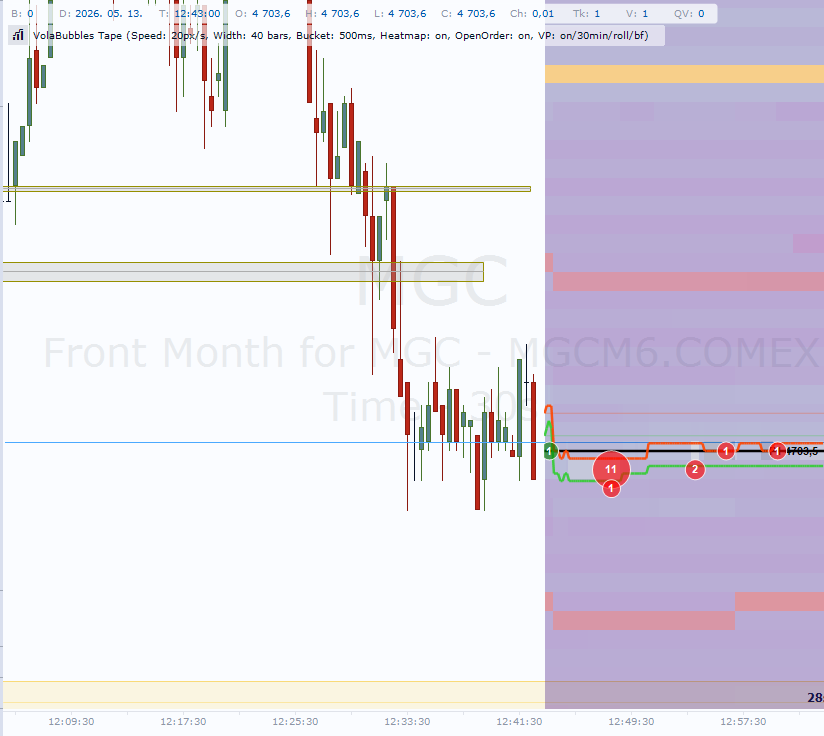
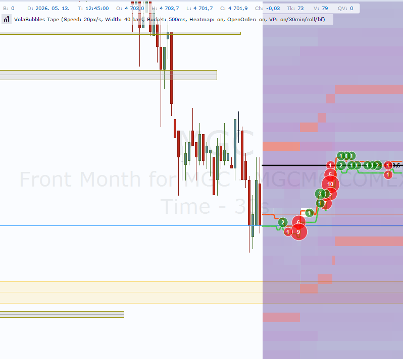

# VolaBubbles Tape

A real-time **order flow tape indicator** for [Quantower](https://www.quantower.com), inspired by ATAS-style trade tapes and DOM heatmaps.

VolaBubbles renders a continuously moving lane to the right of the latest candle:

- **Delta bubbles (tape)** — aggressor buy/sell deltas aggregated per short time bucket and price level, rendered as colored bubbles on the moving tape. Volume is printed on each bubble.
- **Historical bubbles (optional)** — the same delta logic anchored to chart time behind the candles (separate threshold and colors from the tape).
- **Bid / Ask trail** — sampled bid and ask prices flow with the tape.
- **Level 2 heatmap** (optional) — periodic DOM snapshots as vertical price-level columns on the tape, colored by a hot palette (dark blue → purple → red → yellow) with running-max normalization and decay.
- **Market profile** (optional) — horizontal volume histogram on the tape for the configured VP window, behind price action.
- **Volume profile POC** (optional) — POC 1 and POC 2 lines over the same window.

Tape elements drift left-to-right at a configurable pixel-per-second rate. Historical bubbles stay fixed to their bar time.

## Screenshots





## Requirements

- Quantower **v1.145+** (tested on v1.145.17)
- **Level 1** data for tape bubbles, bid/ask, historical bubbles, and volume profile.
- **Level 2 / DOM** data for the L2 heatmap (e.g. Rithmic, CQG). Enable **Show L2 Heatmap** and ensure your connection provides order book data.
- .NET 8 SDK if you want to build from source.

## Install

Quantower loads custom indicators from the **user settings** tree (not from `Program Files`). The usual folder on Windows is:

`C:\Quantower\Settings\Scripts\Indicators\VolaBubbles\`

Create the `VolaBubbles` subfolder if it does not exist. After copying, restart Quantower (or reload scripts if your build supports it), then add the indicator from the chart: **Indicators → Custom → VolaBubbles Tape**.

### Option A: pre-built files from the `dist/` folder (no compilation)

This repository ships a **Release** build under [`dist/`](dist/). It contains `VolaBubbles.dll` plus any companion files the compiler emits (for example `VolaBubbles.deps.json`). Copy **everything** from `dist/` **except** `README.txt` into the Quantower indicators folder above.

PowerShell (from your cloned repo root):

```powershell
$dest = "C:\Quantower\Settings\Scripts\Indicators\VolaBubbles"
New-Item -ItemType Directory -Force -Path $dest | Out-Null
Copy-Item -Path ".\dist\*.dll",".\dist\*.deps.json" -Destination $dest -Force -ErrorAction SilentlyContinue
```

If your Quantower profile lives elsewhere, replace `$dest` with your actual `...\Settings\Scripts\Indicators\VolaBubbles\` path.

### Option B: GitHub Releases zip (optional)

1. Download the latest `VolaBubbles.zip` from the [Releases](../../releases) page (when published).
2. Extract into `C:\Quantower\Settings\Scripts\Indicators\VolaBubbles\`.
3. Add the indicator on a chart as above.

### Option C: build from source

```powershell
git clone https://github.com/3csoft/VolaBubblesTape.git
cd VolaBubblesTape
dotnet build VolaBubbles\VolaBubbles\VolaBubbles.csproj -c Release
```

The build writes the indicator into your Quantower indicators folder (see environment variables below) **and** refreshes the repo-root `dist/` folder on **Release** builds.

#### Maintainer: refresh `dist/` before pushing

```powershell
dotnet build VolaBubbles\VolaBubbles\VolaBubbles.csproj -c Release
git add dist/
git status
git commit -m "chore: refresh dist binaries for release"
```

#### Environment variables (optional)

| Variable | Default | What it points to |
| --- | --- | --- |
| `QuantowerBin` | `C:\Quantower\TradingPlatform\v1.145.17\bin` | Folder containing `TradingPlatform.BusinessLayer.dll` |
| `QuantowerIndicators` | `C:\Quantower\Settings\Scripts\Indicators\VolaBubbles` | Where the built `.dll` is copied |

```powershell
setx QuantowerBin "C:\Quantower\TradingPlatform\v1.146.0\bin"
setx QuantowerIndicators "C:\Quantower\Settings\Scripts\Indicators\VolaBubbles"
```

Open a fresh shell after `setx` for the values to be visible.

## Parameters

### Delta bubbles (tape)

- **Delta Threshold** — minimum `|buy - sell|` per bucket to spawn a tape bubble.
- **Price Step (0 = TickSize)** — price aggregation step; `0` uses the symbol tick size.
- **Bucket (ms)** — aggregation window.
- **Max Bubbles On Tape** — cap on live tape bubbles.
- **Max Bubble Radius** — pixel cap on bubble radius.
- **Show Volume Text** — volume label on bubbles.
- **Positive / Negative Delta Color** — tape bubble colors.

### Historical bubbles (chart)

- **Show Historical Bubbles** — anchor bubbles behind candles at their bar time.
- **Max Historical Bubbles** — how many remain on chart (oldest dropped).
- **Hist. Bubble Backfill On Start** — preload from tick history when available.
- **Hist. Bubble Lookback (min)** — backfill window.
- **Historical Delta Threshold** — separate from tape threshold.
- **Historical Positive / Negative Delta Color** — separate from tape colors.

### Tape geometry & motion

- **Tape Width (bars)** — tape strip width to the right of the last candle.
- **Tape Speed (px/sec)** — drift speed.

### Bid / Ask

- **Show Bid/Ask Lines** — moving bid/ask trail on the tape.
- **Bid Line Color / Ask Line Color** — trail colors; faded extension to the live edge.

### L2 Heatmap

- **Show L2 Heatmap** — master toggle (subscribes to L2 via `NewLevel2`).
- **Heatmap Price Range (+/-)** — vertical extent around mid-price in price units.
- **Heatmap Sample (ms)** — DOM sampling interval.
- **Heatmap Decay (sec)** — running-max window for color normalization.
- **Heatmap Gamma (0.1..2.0)** — intensity curve.
- **Heatmap Min Alpha %** — weak levels below this are not drawn.
- **Heatmap Max Levels (cap)** — max L2 levels per side.
- **Heatmap Opacity (0.0..1.0)** — palette opacity multiplier.

### Volume profile & POC

- **Show Volume Profile POC** — POC 1 / POC 2 horizontal lines on the tape.
- **VP Window (minutes)** — rolling or fixed lookback.
- **VP Rolling Window (false = Fixed)** — rolling vs reset every N minutes.
- **POC 1 / POC 2 Color**, **POC 2 Min Distance (ticks)**, **Show POC Labels**.
- **VP Backfill On Start** — preload profile from tick history.

### Market profile (histogram)

- **Show Market Profile** — volume-by-price bars on the tape, behind bid/ask and bubbles.
- **Market Profile Color** / **Market Profile Opacity (0.0..1.0)**.

## How the heatmap normalizes color

For each rendered cell:

1. `t = size / runningMax` where `runningMax` is the largest level size within the **decay window** (default 30 seconds).
2. `t = pow(t, Gamma)` shapes sensitivity.
3. If `t < MinAlphaPercent / 100`, the cell is skipped.
4. Otherwise color is interpolated across a 5-stop hot palette, then scaled by `HeatmapOpacity`.

## Troubleshooting

- **No heatmap** — confirm L2/DOM is enabled on your connection, **Show L2 Heatmap** is on, and **Heatmap Price Range** covers the visible book. Restart the indicator after enabling L2 so the subscription is sent.
- **No historical bubbles** — trades need aggressor side (buy/sell); bar-only fallback is approximate.
- **No POC / market profile** — needs trade ticks or backfill; enable **VP Backfill On Start**.

## Roadmap

- Per-price persistent heatmap cell trail.
- Historical L2 replay window.
- Marketplace submission.

## Disclaimer

This software is provided **for educational and personal-research purposes only**. It is not financial advice. Trading involves substantial risk. **Test on a simulator before using on a live account.**

## License

Released under the [MIT License](LICENSE).
